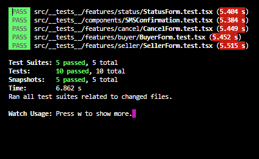

# PROJECT : Secure Trading TEST CASE

## Table of contents

- [Screenshot](#screenshot)
- [Links](#links)
- [Libraries-Tools](#libraries-tools)
- [Project Skeleton ](#project-skeleton)
- [Project Structure](#project-structure)
- [Testing Content](#testing-content)
- [Caching Mechanism](#caching-mechanism)
- [Author](#author)

## Screenshot

<p align="center">

</p>

## Links

- [Live Website](https://secure-trading-typescript-omerkaz.vercel.app/)

## Libraries-Tools

- reduxtoolkit
- reduxjs
- react router
- react testing library
- jest
- react icons
- yup
- formik
- bootstrap
- referral-codes

## Project Skeleton

```

|----public
     |----index.html
|----src
    |----__tests__
            |----components   
            |----features
                |----buyer
                |----cancel
                |----home
                |----root
                |----seller
                |----status
    |----components
        |----button
        |----cards
        |----errorMessages
        |----form
        |----SMSConfirmation
    |----features
        |----buyer
        |----cancel
        |----home
        |----root
        |----seller
        |----status
    |----mocks
    |----routes
    |----store
    |----utils       
        |----codeGenerator
        |----customHooks
        |----formsInitialValue
        |----yup
    
```

## Component Structure

<p align="center">

</p>

## Testing Content

- Testing some components renders correctly


<p align="center">

</p>

## Rapor

Merhaba, elimde bir APİ olsaydı eğer her şey daha kolay(epey) olabilirdi fakat bu durumun bana şöyle bir artısı oldu, redux'a APİ taklidi yaptırdım ve bu da arka taraftaki işleri halletmeye çalışırken logic kapasitemin proje içerisinde  artmasını sağladı. Yani bu projeye başlarkenki ben ile şu anki ben arasındaki en net fark bu diyebilirim. Öte yandan daha önce formlar ile bu kadar fazla çalışmamıştım, bu açıdan da bana katkısı oldu diyebilirim. Suni APİ yaratabilirdim fakat redux'ı daha iyi kavrayabilmek açısından da iyi olacağını düşündüğüm için böyle bir yol tercih ettim. Projede Full Test Coverage olmasa da bazı componentlere test yazdım mock konseptine dair kendimi geliştirdiğim için APİ olsaydı eğer elbette daha zevkli bir test yazımı olabilirdi. 
-test yazmayı seven ender kişilerdenim sanırım.-


## Author

- Author - Ömer KAZ
<p><i>All codes belong to me</i></p>
<center> &#8987; Happy Coding  &#9997; </center>

